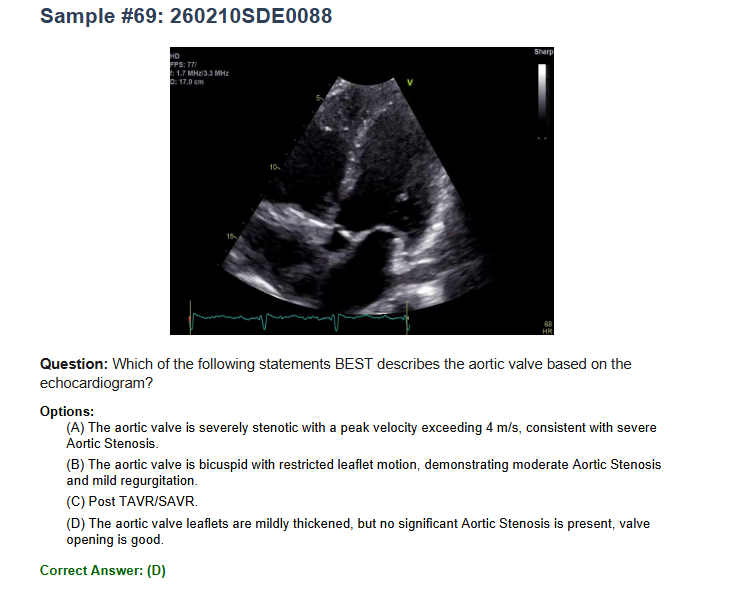

# EchoNet-MIMIC VQA Dataset

## Purpose

The EchoNet-MIMIC Visual Question Answering (VQA) dataset is designed to evaluate AI models' ability to understand and interpret echocardiography videos through natural language questions and answers. This dataset combines echocardiogram video data from the MIMIC-IV-Echo database with expert-curated and edited questions covering various aspects of cardiac imaging interpretation (i.e., disease diagnosis, anatomical view recognition, measurement grading, and descriptive analysis).

## Dataset Statistics

The dataset contains **258 questions** (Single Visual QA) across multiple task categories:

### Content Types
- **Diagnosis**: 226 questions
- **View**: 32 questions

### Question Types
- **Binary**: 113 questions - Yes/No questions requiring binary responses
- **Diagnosis**: 53 questions - Specific diagnostic reasoning questions
- **Descriptive**: 46 questions - Open-ended descriptive questions about cardiac features
- **View**: 32 questions - Echocardiographic view identification
- **Grading**: 14 questions - Severity grading questions (like mild/moderate/severe)

#### Examples by Question Type

| Question Type | Example Question | Options | Answer |
|---------------|------------------|---------|--------|
| **Binary** | Is a Pacemaker present? | A: No<br>B: Yes | B |
| **Diagnosis** | Which of the following conditions is present? | A: Tricuspid Stenosis<br>B: Pulmonary Hypertension<br>C: Right Ventricular Hypertrophy<br>D: Pacemaker/ICD Lead | D |
| **Descriptive** | Which of the following statements provides the MOST accurate description of the observed findings? | A: The image displays a normal tricuspid valve with no evidence of regurgitation.<br>B: The image shows severe tricuspid stenosis with a markedly elevated pressure gradient across the valve<br>C: The image reveals the presence of a Pacemaker lead, no significant valvular stenosis and regurgitation.<br>D: The image demonstrates tricuspid valve prolapse with mild tricuspid regurgitation. | C |
| **View** | Which echocardiographic view is displayed? | A: Apical 5-Chamber with Doppler<br>B: Apical 3-Chamber without Doppler<br>C: Parasternal Long Axis with Doppler<br>D: Apical 2-Chamber with Doppler | A |
| **Grading** | What is the grade of Aortic Stenosis? Can you guess? | A: None/Normal<br>B: Mild<br>C: Moderate<br>D: Severe | D |

## Task Types

The dataset evaluates the following clinical capabilities:

1. **Disease Detection and Diagnosis** - Identifying pathological conditions from echocardiogram videos
2. **View Recognition** - Classifying standard echocardiographic views (e.g., parasternal long axis, apical four-chamber)
3. **Severity Grading** - Assessing the severity of cardiac abnormalities
4. **Descriptive Analysis** - Providing detailed descriptions of cardiac structures and functions

## Folder Structure

### Data File Structure

The main CSV file (`MIMIC_Echo_1qa_SDE_vFINAL_share_d20260210_111554.csv`) contains the following columns:

- `question_id`: Unique identifier for each question
- `study_id`: MIMIC study identifier
- `target_id`: Target concept/disease identifier
- `target_name`: Name of the target concept
- `content_type`: Type of content (Diagnosis/View)
- `question_type`: Format of question (Binary/Diagnosis/Descriptive/View/Grading)
- `explanation`: Rationale from the clinical report
- `dicom_path`: Path to source DICOM file (Please download and save your workspace)
- `mp4_path`: Path to converted MP4 video (you can make mp4 video with `Medgemma-challenge/EchoNet-MIMIC_VQA/0_convert_Dicom_to_AVI_save.py`)
- `disease_label`: Disease category label
- `report`: Full clinical echocardiogram report (Raw report from MIMIC)
- `Final_Question`: The question text
- `Final_option_A/B/C/D`: Multiple choice options
- `Final_correct_option`: Correct answer
- `review_timestamp`: Timestamp of quality review

## Sample

A sample question-answer pair with its corresponding echocardiogram video frame is shown below:



## Source Data

The echocardiogram videos are sourced from the MIMIC-IV-Echo database. To download the source DICOM files:

**MIMIC-IV-Echo Homepage**: https://physionet.org/content/mimic-iv-echo/0.1/

### MIMIC-IV-Echo File Structure
```
/YOUR workspace/.../DICOM/MIMIC
├── p10/
│   └── p10690270/
│       ├── s95240362/
│       │   ├── 95240362_0004.dcm
│       │   └── ...
│       └── s90045402/
│           ├── 90045402_0001.dcm
│           └── ...
└── p19/
    └── p19425623/
        └── s90267113/
            ├── 90267113_0001.dcm
            └── ...
```

**Note**: Access to MIMIC-IV-Echo requires credentialed access through PhysioNet.